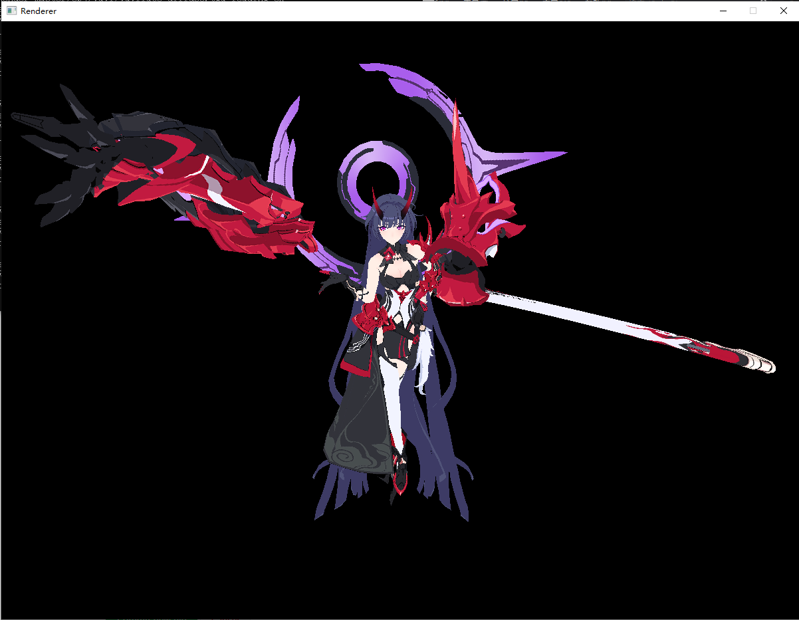
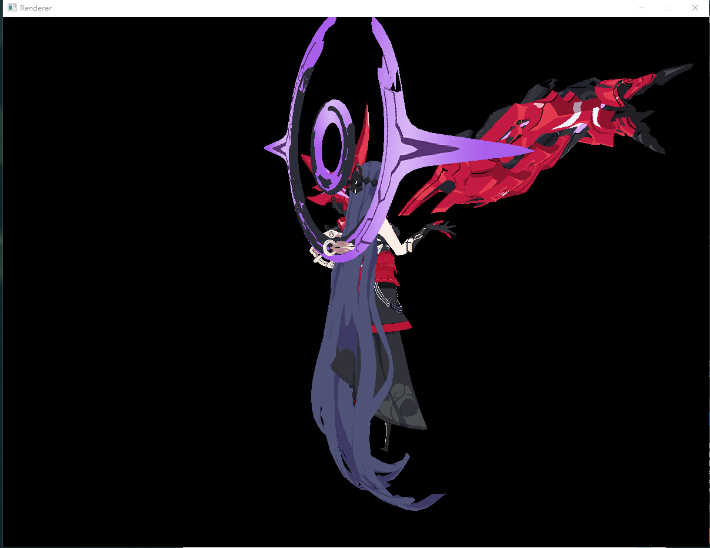
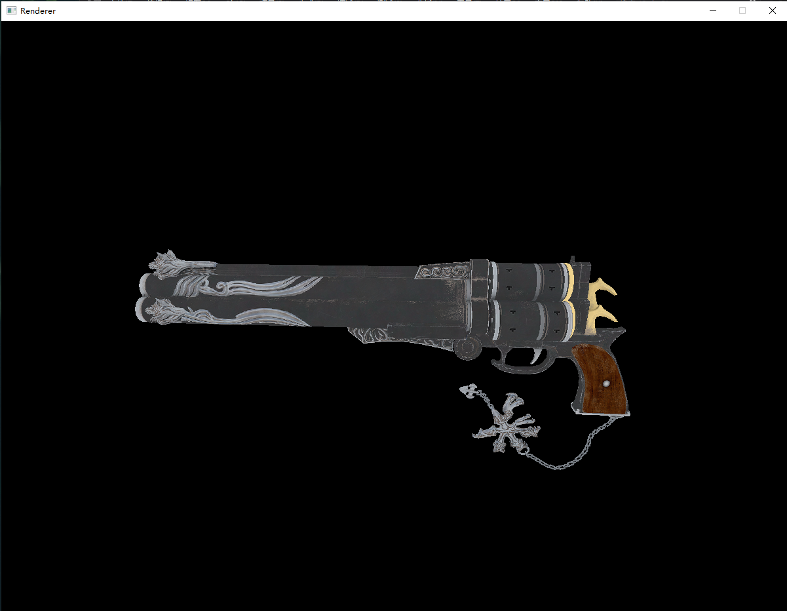

# 软渲染器
做这个项目的起因主要是在大三学习计算机图形学的渲染管线时，总有总似懂非懂的感觉  
想把理论知识串联起来时总是感觉中间缺少了一些步骤，在学习OPENGL后这种感觉有所减弱，但还是感觉不太明朗  
之后幸运地在知乎看到了“如何用C++写一个光栅化渲染器”的话题，也阅览了高赞回答中的学习路线，然后开始动手实现自己的渲染器,并且对代码进行了接近逐行注释，如果有缘被人看到这个项目，要看懂也很简单  
  
目前已经实现了基本的功能，包括：  
1、在参考Sokolov 500行实现一个渲染器的基础上，加入了图形界面  
2、可移动相机  
3、顶点着色器和片元着色器，可以通过编写着色器实现不同的效果  
4、齐次裁剪、背面剔除、深度缓存  
5、切线空间贴图  
6、Blinn-Phong反射模型  

其中参考了知乎高赞回答：  
图形界面：https://www.zhihu.com/question/24786878  
齐次空间裁剪：https://zhuanlan.zhihu.com/p/162190576  
课程选择了闫令琪老师的Game-101  

目前存在的问题：   
因为是采用CPU并且是单线程进行渲染，当模型面片数多时，渲染的帧率非常低，帧率优化将会是之后主要需要考虑的事情，  
会根据学习情况尝试加入多线程载入和LOD  

接下来要进行的工作：   
阴影、天空盒、其他光照模型、LOD、多线程、动画    

目前渲染效果：  
 

